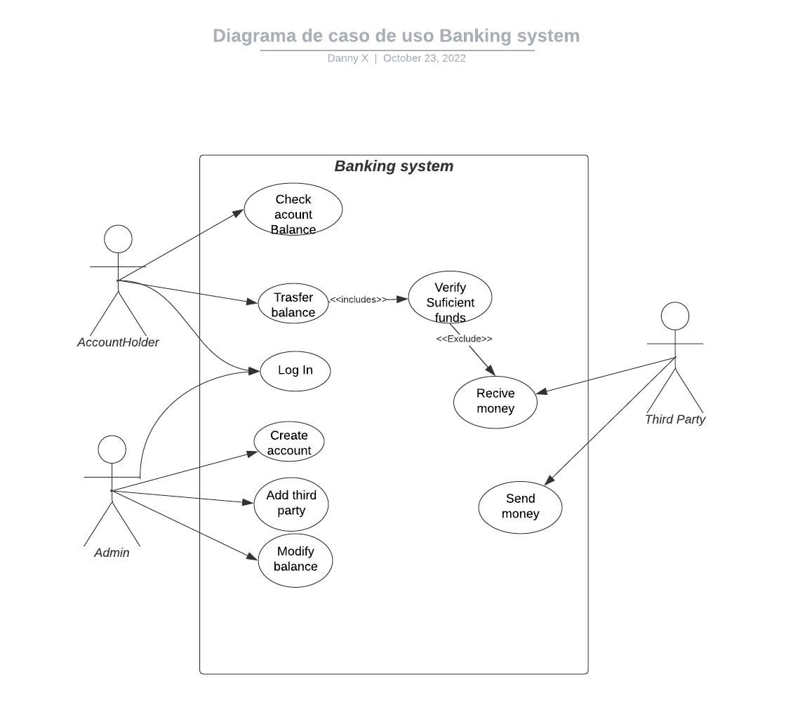
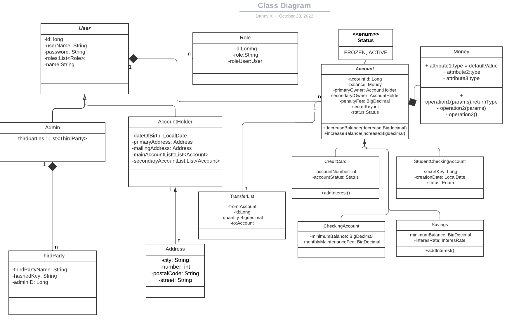

# BankRestApi
## Table of Contents
1. [General Info](#general-info)
2. [Case Diagram](#case-diagram)
3. [Class Diagram](#class-diagram)
4. [Account Requirements](#account-requirements)
5. [User Requirement](#user-requirements)
6. [Technical Requirement](#technical-requirement)
7. [Deliverables](#deliverables)

## General Info
Midterm projects are to completed individually. You may not collaborate with classmates on this assignment. Should you need assistance, you should reach out to your instructional staff.

This project is designed to be challenging and should be completed as thoroughly as possible.

In this project, you will be building a banking system. You should meet all the requirements below:
## Case Diagram

## Class Diagram

### Account Requirements

The system must have 4 types of accounts: StudentChecking, Checking, Savings, and CreditCard.

#### Checking

Checking Accounts should have:

1. A balance
2. A secretKey
3. A PrimaryOwner
4. An optional SecondaryOwner
5. A minimumBalance
6. A penaltyFee
7. A monthlyMaintenanceFee
8. A creationDate
9. A status (FROZEN, ACTIVE)

When creating a new Checking account, if the primaryOwner is less than 24, a StudentChecking account should be created otherwise a regular Checking Account should be created.
Checking accounts should have a minimumBalance of 250 and a monthlyMaintenanceFee of 12

#### StudentChecking

Student Checking Accounts are identical to Checking Accounts except that they do NOT have:

1. A monthlyMaintenanceFee
2. A minimumBalance

#### Savings

Savings are identical to Checking accounts except that they

1. Do NOT have a monthlyMaintenanceFee
2. Do have an interestRate

Savings accounts have a default interest rate of 0.0025
Savings accounts may be instantiated with an interest rate other than the default, with a maximum interest rate of 0.5
Savings accounts should have a default minimumBalance of 1000
Savings accounts may be instantiated with a minimum balance of less than 1000 but no lower than 100
Interest and Fees should be applied appropriately
Interest on savings accounts is added to the account annually at the rate of specified interestRate per year. That means that if I have 1000000 in a savings account with a 0.01 interest rate, 1% of 1 Million is added to my account after 1 year. When a savings account balance is accessed, you must determine if it has been 1 year or more since either the account was created or since interest was added to the account, and add the appropriate interest to the balance if necessary.

#### CreditCard

CreditCard Accounts have:

1. A balance
2. A PrimaryOwner
3. An optional SecondaryOwner
4. A creditLimit
5. An interestRate
6. A penaltyFee

CreditCard accounts have a default creditLimit of 100
CreditCards may be instantiated with a creditLimit higher than 100 but not higher than 100000
CreditCards have a default interestRate of 0.2
CreditCards may be instantiated with an interestRate less than 0.2 but not lower than 0.1
Interest and Fees should be applied appropriately

The penaltyFee for all accounts should be 40.
If any account drops below the minimumBalance, the penaltyFee should be deducted from the balance automatically

Interest on credit cards is added to the balance monthly. If you have a 12% interest rate (0.12) then 1% interest will be added to the account monthly. When the balance of a credit card is accessed, check to determine if it has been 1 month or more since the account was created or since interested was added, and if so, add the appropriate interest to the balance.

### User Requirements
The system must have 3 types of Users: Admins and AccountHolders.

#### AccountHolders

The AccountHolders should be able to access their own accounts and only their accounts when passing the correct credentials using Basic Auth. AccountHolders have:

1. A name
2. Date of birth
3. A primaryAddress (which should be a separate address class)
4. An optional mailingAddress
   AccountHolders should be able to access their own account balance
   Account holders should be able to transfer money from any of their accounts to any other account (regardless of owner). The transfer should only be processed if the account has sufficient funds. The user must provide the Primary or Secondary owner name and the id of the account that should receive the transfer.

#### Admins
Admins only have a name
Admins can create new accounts. When creating a new account they can create Checking, Savings, or CreditCard Accounts.

Admins should be able to access the balance for any account and to modify it.

#### ThirdParty

The ThirdParty Accounts have a hashed key and a name.

There must be a way for third-party users to receive and send money to other accounts.
Third-party users must be added to the database by an admin.
In order to receive and send money, Third-Party Users must provide their hashed key in the header of the HTTP request. They also must provide the amount, the Account id and the account secret key.

## Technical Requirement

1. Include a Java/Spring Boot backend.
2. Everything should be stored in MySQL database tables.
3. Include at least 1 GET, POST, PUT/PATCH, and DELETE route.
4. Include authentication with Spring Security.
5. Include unit and integration tests.
6. Include robust error handling.

## Deliverables

1. A working REST API, built by you that runs on a local server.
2. The URL of the GitHub repository for your app.
3. A simplified class diagram representing your project structure should be added to the repo.
4. Adequate and complete documentation in the README.md file.
